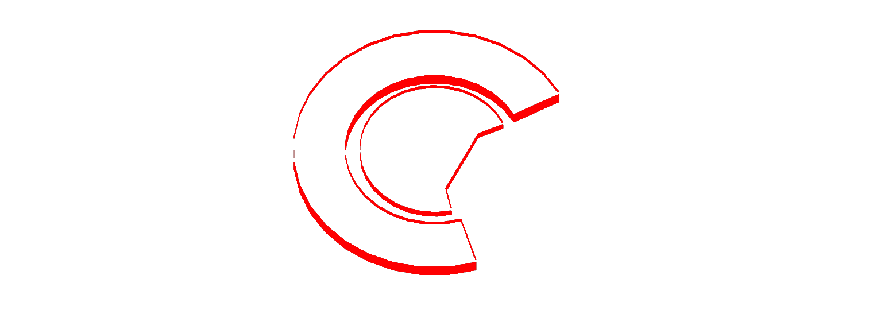

### 🚨 Reminder  
Please keep all comments **respectful** and focused on the **content**.  
Any form of **negativity** or **sarcasm** may be **reported to GitHub team**.  

---

# MUCE Language - Minimalistic Updated C++ Extension

---

What is MUCE?
> MUCE or Minimalistic Updated C++ Extension is a lightweight domain-specific language (DSL) that extends C++ with clean syntax and enhanced control structures.
> It’s built with a custom compiler `muce.exe`

### Supports:

Full C++ Support :
> A language that supports everything that C++ supports.

Doxygen Support :
> language has excellent support for Doxygen-style documentation.
> it recognizes tags like `@name` and supports embedded code examples using the `..@{}...` block syntax.
