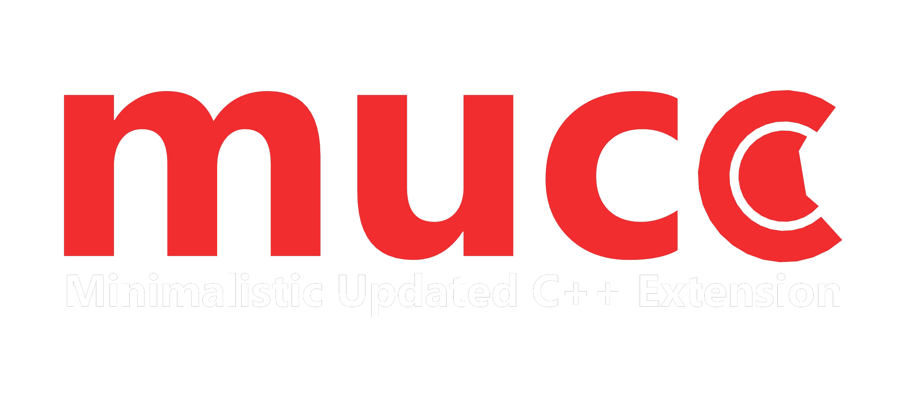

### 🚨 Reminder  
Please keep all comments **respectful** and focused on the **content**.  
Any form of **negativity** or **sarcasm** may be **reported to GitHub team**.  

---

# MUCE Language - Minimalistic Updated C++ Extension


---


What is MUCE?
> MUCE aka Minimalistic Updated C++ Extension is a lightweight domain-specific language (DSL) that extends C++ with clean syntax and enhanced control structures.
> It’s built with a custom compiler `muce.exe`

### Supports:

Full C++ Support :
> A language that supports everything that C++ supports.

Templates Support :
> language support template, you can create project using template, using:
> ```bash
> muce(.exe) -new <template-name> <path> <folder> <main_name>
> ```
> example : 
> ```bash
> muce -new template1 D:\MUCE_projects first_project Program
> ```
> result:
> ```bash
> MUSE_projects\
>  - first_project\
>   - Program.mcpp
>   - template files . . . 
> ```

Doxygen Support :
> language has excellent support for Doxygen-style documentation.
> it recognizes tags like `@name` and supports embedded code examples using the `..@{}...` block syntax.

Package Manager Support : 
> Language support package manager that helps user download packages and libraries from this repository

Support Translation To Executable `.exe` and C++ Language `.cpp` :
> Language support translation to exe using G++ Compiler (main cpp compiler) and translation to cpp file  `output.cpp`
